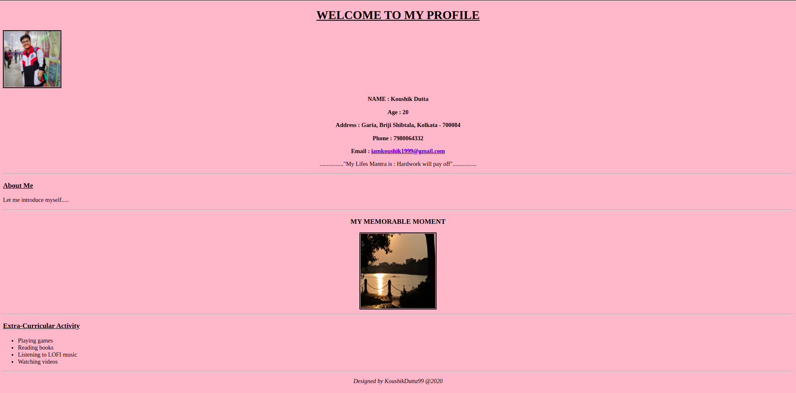
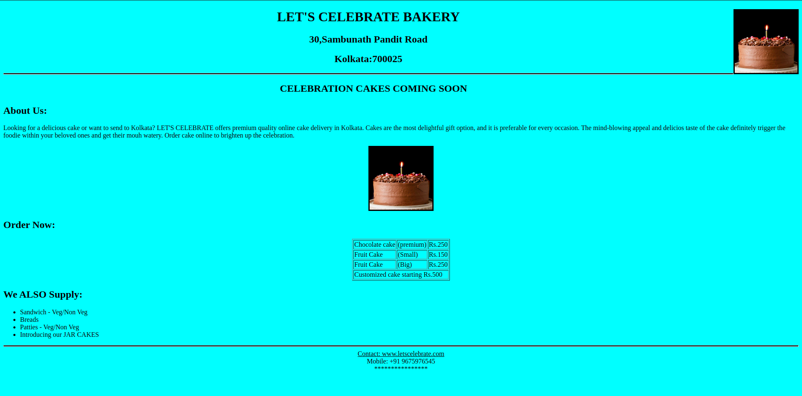
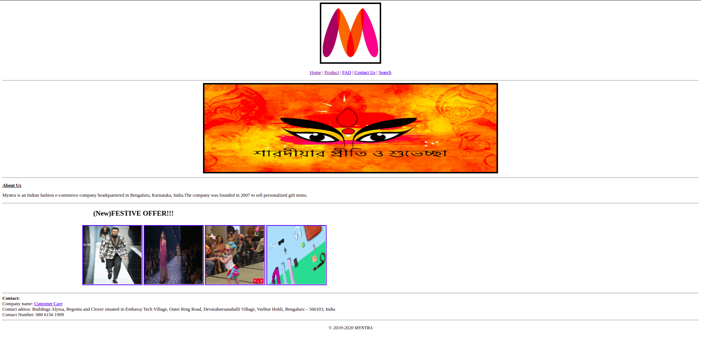
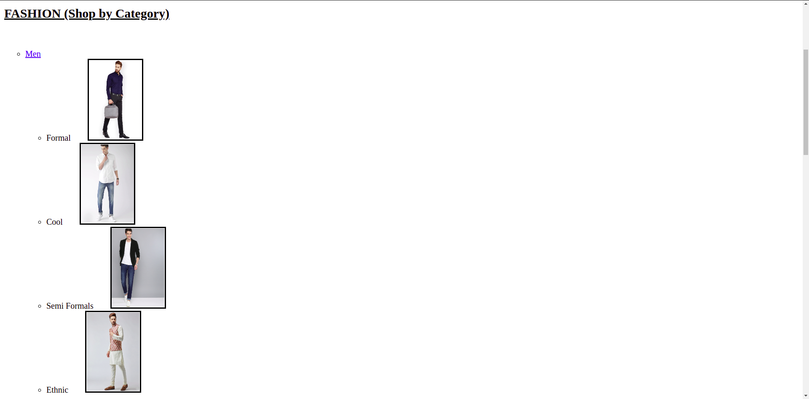
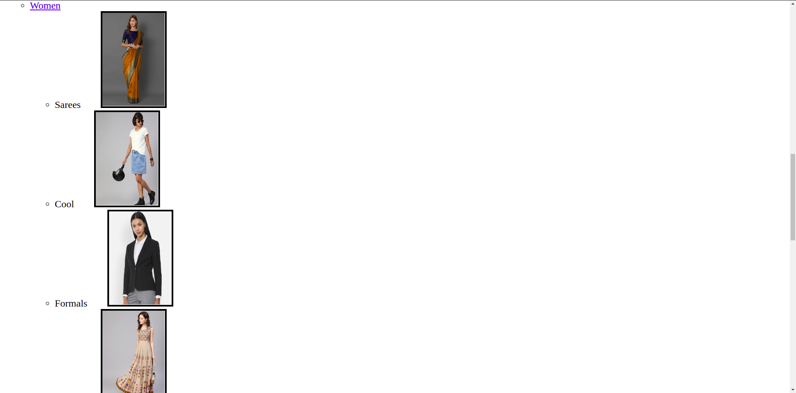
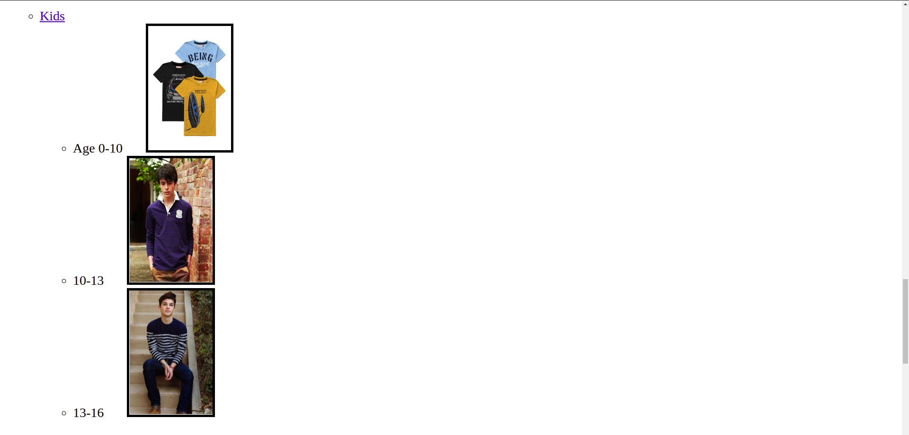
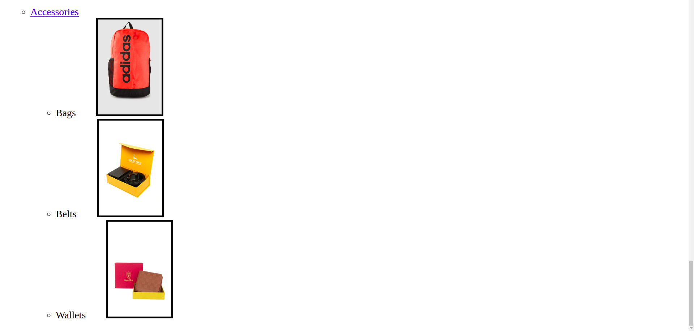

# Practice_HTML

## BIODATA_practice-HTML
HTML to create biodata of myself with "My Profile" in center position,"My Details" are in center position, Their i an "About Me" section and "Extra-Curricular Activity" section. 

## E_Commerce_Design
E Commerce Design(Myntra) practice with "Myntra_Home.html" and "fasion.html" and "FAQ.pdf" file and having Chatagories like Men, Women, Kids, Accsesories on Fasion page. 

## Cake_HTML
A simple website for bakery shop for cakes. 
Header with Bakery shop name and address, then about the shop and a photo of their cake, different cake category with different cake price and at the end differnt demand of category.

- Home Page

- Fashion Page 1

- Fashion Page 2

- Fashion Page 3

- Fashion Page 4

